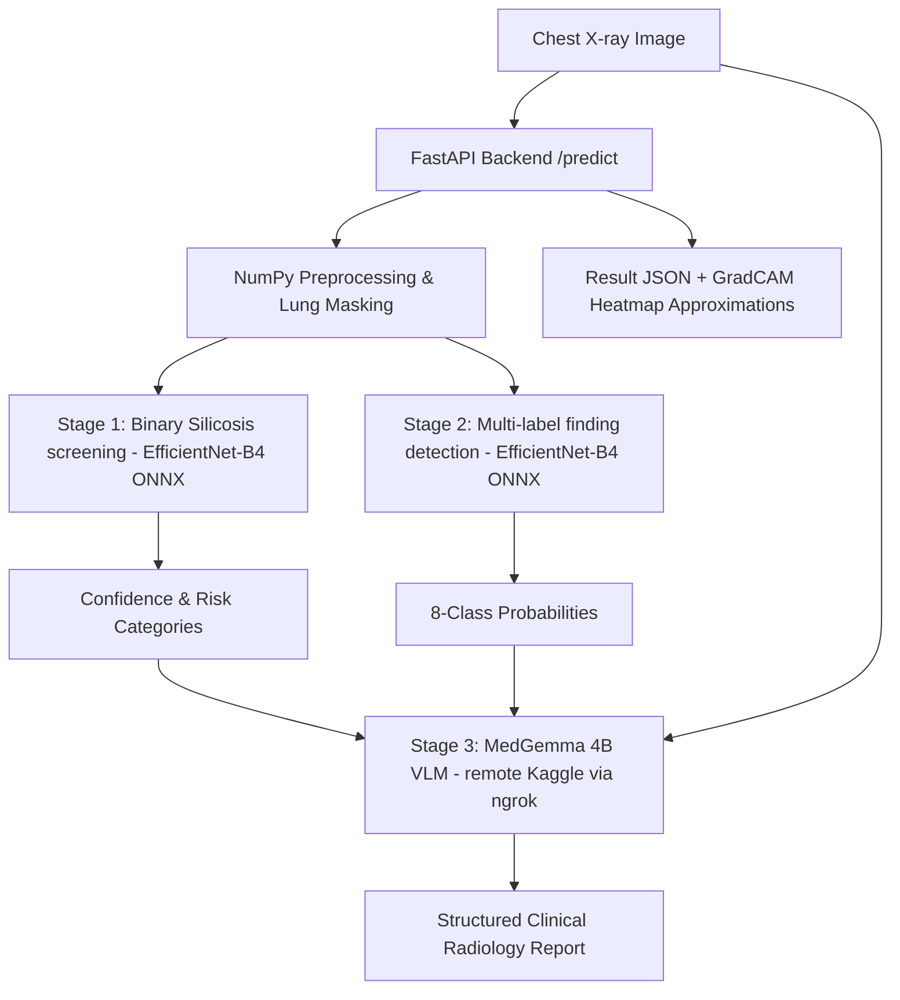

# Silicosis Screening & Diagnostic System

This repository contains the production-ready implementation of the Silicosis Screening and Diagnostic System, prepared for final internship handover.

The system uses a **three-stage AI diagnostic pipeline** to screen chest X-rays for silicosis risk, identify secondary radiological findings, and generate a structured clinical radiology report.

---

## 1. System Architecture & Flow



1. **Stage 1 — Binary screening (EfficientNet-B4)**: Classifies the image as *Silicosis-Positive* or *Silicosis-Negative*. Uses an optimized clinical decision threshold of **0.811** (Youden optimal cutoff) to balance sensitivity and specificity.
2. **Stage 2 — Finding detection (EfficientNet-B4 Multi-Label)**: Detects the presence of 8 secondary findings: nodules, hilum abnormalities, consolidation, fibrosis, cavity, bronchiectasis, ground glass opacity, and pleural thickening.
3. **Stage 3 — Report generation (MedGemma 4B with QLoRA Adapter)**: Runs remotely on Kaggle (T4 GPU) to overcome local hardware constraints. Receives the preprocessed chest X-ray image and the classifier outputs to generate a structured `EXAMINATION` / `FINDINGS` / `IMPRESSION` report.

---

## 2. Directory Structure

```
/silicosis-risk-detector
│
├── /data/                  ← Sample chest X-rays (6 normal, 6 silicosis) for testing
│
├── /models/                ← ONNX models (not checked into Git; download separately)
│   ├── binary_model.onnx
│   └── finding_model.onnx
│
├── /pipeline/              ← Code related to model training and conversion
│   ├── train.py            ← Reference training script (designed for Kaggle)
│   ├── data_prep.py        ← Dataset definitions and loading pipeline
│   └── convert_to_onnx.py  ← Utility to export PyTorch weights to ONNX format
│
├── /src/                   ← Production application source code
│   ├── api.py              ← FastAPI backend app
│   ├── inference.py        ← ONNX Runtime inference wrapper
│   └── preprocessor.py     ← Pure NumPy/OpenCV preprocessor (no PyTorch)
│
├── /kaggle_api/            ← Kaggle-hosted inference server code
│   └── medgemma_api_server.py
│
├── config.yaml             ← System-wide configuration options
├── Dockerfile              ← Production Docker build configuration
├── .dockerignore           ← Prevents bloated container image size
├── requirements.txt        ← Production python dependencies (lightweight, CPU-only)
└── README.md               ← This documentation
```

---

## 3. Installation & Quick Start

### Option A: Local Deployment (No Docker)

1. **Create and activate a virtual environment**:
   ```bash
   python -m venv venv
   source venv/bin/activate  # Windows: venv\Scripts\activate
   ```

2. **Install production dependencies**:
   ```bash
   pip install -r requirements.txt
   ```

3. **Install ONNX model weights**:
   If you have the PyTorch `.pth` files, put them in the `models/` directory and run:
   ```bash
   pip install torch torchvision
   python pipeline/convert_to_onnx.py
   ```
   This will output `binary_model.onnx` and `finding_model.onnx` into `models/`.

4. **Start the FastAPI server**:
   ```bash
   uvicorn src.api:app --reload --port 8000
   ```
   - **Swagger API Docs**: Visit `http://localhost:8000/docs` to test endpoints via browser.
   - **Health check**: `http://localhost:8000/health`

---

### Option B: Containerized Deployment (Docker)

To run the application inside a container:

1. **Build the Docker image**:
   ```bash
   docker build -t silicosis-service .
   ```
   *Expected build time: ~2-4 minutes.*

2. **Run the container**:
   Provide your remote MedGemma ngrok URL as an environment variable (optional, see below):
   ```bash
   docker run -p 8000:8000 -e KAGGLE_NGROK_URL="https://your-ngrok-url.ngrok-free.app" silicosis-service
   ```
   *Note: Docker container requires only ~800MB disk footprint because it runs CPU inference via ONNX Runtime without PyTorch.*

---

## 4. MedGemma Report Generation (Kaggle Server)

Because the **MedGemma 4B VLM** requires substantial VRAM to run (loaded in 4-bit NF4 precision), it is decoupled from the main server and runs on a free **Kaggle T4 GPU** instance.

### Running the Kaggle Server:
1. Open a new Kaggle notebook with **T4 GPU** accelerator turned on.
2. Sign up at [ngrok](https://ngrok.com) and retrieve your auth token from the dashboard.
3. Open `kaggle_api/medgemma_api_server.py`.
4. Update `NGROK_AUTH_TOKEN` (line 54) with your token.
5. Create a Kaggle Secret named `HF_TOKEN` containing your Hugging Face API token (or paste it into `HF_TOKEN` at line 66).
6. Copy-paste the entire `medgemma_api_server.py` script into a notebook cell and run it.
7. Wait ~3 minutes for model weights to download. Copy the printed public URL (e.g., `https://xxxx-xx-xx.ngrok-free.app`).
8. Either paste this URL into your local `config.yaml` (`kaggle_api.ngrok_url`), or set it as `KAGGLE_NGROK_URL` environment variable when running.

---

## 5. API Reference

### 1. `GET /health`
Liveness check endpoint.
* **Response**: `{"status": "online", "service": "silicosis-detection-api"}`

### 2. `GET /kaggle-status`
Checks if the remote MedGemma report generator is reachable and responsive.

### 3. `POST /predict`
Submit a chest X-ray image for full screening, finding detection, and clinical report generation.
* **Body**: `multipart/form-data` with key `file` (image binary, JPEG/PNG).
* **Example curl command**:
  ```bash
  curl -X POST http://localhost:8000/predict -F "file=@data/silicosis_001.jpg"
  ```
* **Sample JSON Response**:
  ```json
  {
    "prediction": "Silicosis-Positive",
    "confidence_score": 0.9423,
    "inference_time_ms": 1542,
    "visualizations": {
      "gradcam_overlay_base64": "iVBORw0KGgoAAAANSUhEUg...",
      "original_image_base64": "iVBORw0KGgoAAAANSUhEUg...",
      "gradcam_consolidation_base64": "iVBORw0KGgo..."
    },
    "additional_inference_metadata": {
      "risk_category": "High Risk",
      "risk_pct": 94.2,
      "youden_threshold": 0.811,
      "findings_detected": ["Consolidation", "Multiple Nodules / Nodular Opacity"],
      "findings_probabilities": {
        "Multiple Nodules / Nodular Opacity": 0.72,
        "Hilum Abnormality": 0.12,
        "Consolidation": 0.86,
        "Fibrosis": 0.45,
        "Cavity": 0.05,
        "Bronchiectasis": 0.08,
        "Ground Glass Opacity": 0.22,
        "Pleural Thickening": 0.15
      },
      "clinical_report": "EXAMINATION: Frontal chest X-ray...\nFINDINGS: Consolidation is seen...\nIMPRESSION: Consistent with silicosis...",
      "medgemma_status": "online",
      "model_notes": "Binary AUC 0.9078. Decision support tool only."
    }
  }
  ```

---

## 6. Disclaimers & Known Limitations

1. **Evaluation Scope**: The binary classifier achieved an AUC of **0.8888** on internal testing (IIT Jodhpur dataset). Performance on external hospital machines may degrade to **0.83 - 0.87** due to differences in scanner calibration.
2. **TB Confounding**: Tuberculosis (TB) and silicosis present highly similar visual characteristics. The model may trigger false positives on TB-positive/silicosis-negative patients. Specificity at a default threshold of 0.5 is 67.2%; using the Youden threshold of 0.811 raises specificity to **84.3%** at the cost of slight sensitivity reduction.
3. **Reliability of Finding Classifier**: Only *Consolidation* (AUC 0.86) and *Cavity* (AUC 0.78) have high clinical reliability. Findings like *Hilum Abnormality* (AUC 0.37) are unreliable and should not be used as clinical indicators.
4. **ONNX GradCAM Approximation**: True backpropagation-based GradCAM is not supported under ONNX Runtime CPU execution. The container serves a Gaussian saliency heatmap overlay. Real GradCAM is available in PyTorch scripts in `src/` for GPU environments.
5. **No Medical Approval**: This is a research prototype decision-support tool. It has **NOT** been approved for clinical diagnostic use by FDA, CDSCO, or other medical regulatory bodies.
